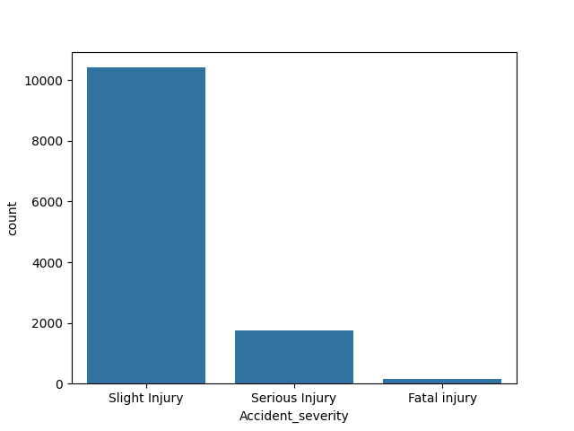
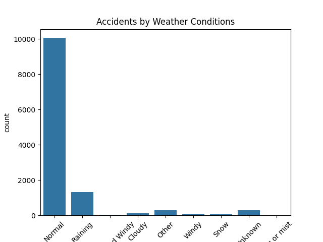
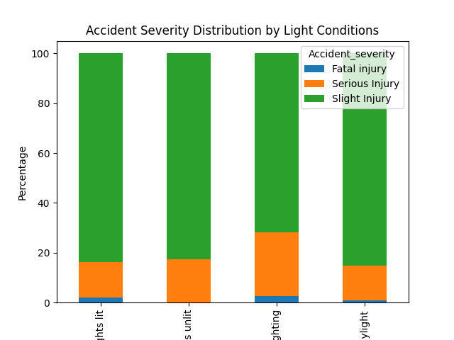
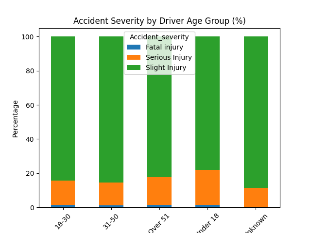
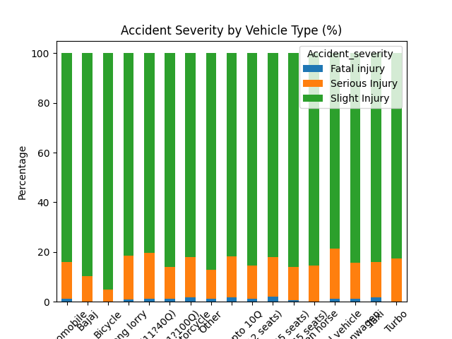

# 🚦 Road Accident Severity Analysis (India)

## 📌 Project Overview
This project analyzes road accident data in India to identify key factors influencing accident severity. The goal is to understand how environmental conditions, driver characteristics, and vehicle types contribute to accident outcomes.

---

## 🎯 Objectives
- Analyze patterns in accident severity
- Identify high-risk conditions
- Understand impact of weather, light, and driver behavior

---

## 🛠️ Tools & Technologies
- Python
- Pandas
- Matplotlib / Seaborn
- Google Colab

---

## 📊 Key Insights

- Most accidents occur during normal weather and daylight due to higher traffic volume
- Accidents in dark conditions are more severe
- Younger drivers show higher involvement in severe accidents
- Drivers without a license indicate risky driving patterns
- Public transport and motorcycles show higher fatal proportions
- Combination of darkness and rain increases accident severity

---

## 📈 Visualizations

### Accident Severity Distribution

### Weather Conditions

### Light Conditions

### Age vs Severity

### Vehicle Type vs Severity

---

## ⚠️ Limitations
- Presence of missing values ("Unknown" categories)
- Some conditions have small sample sizes

---

## 📌 Conclusion
Accident severity is influenced by a combination of environmental, driver, and vehicle-related factors. Improving visibility conditions and regulating risky driving behavior can help reduce severe accidents.

---

## 👩‍💻 Author
Kirti
